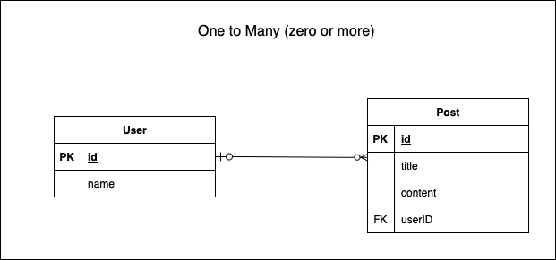

### Prisma での CRUD

Prisma では CRUD の操作は Prisma Client の API を通して行うことができる

公式リファレンスは[こちら](https://www.prisma.io/docs/orm/prisma-client/queries/crud#get-record-by-id-or-unique-identifier)

---

### 基本的な Primsa Client の利用の流れ

1\. '@prisma/client' から PrismaClient クラスをインポートする

2\. PrismaClient クラスからインスタンスを作成する

3\. async 関数の中で、Prisma client API を使って、 CRUD 操作をする

4\. CRUD 操作が終わったら、 DB との接続を切る


```ts
// 1. PrismaClient クラスのインポート
import { PrismaClient } from '@prisma/client';

// 2. PrismaClient クラスからインスタンス作成
const prisma = new PrismaClient();


const createData = async() => {
    // 3.prisma から CRUD 操作
}

createData().then((result) => {
    console.log(result);
}).catch((e) => {
    console.log(e);
}).finally(() => {
    // DB 接続を切断
    prisma.$disconnect();
});
```

---

### Create (データ登録)

### 1件登録

- create
    - 引数: { data: { 対象modelのprops } }
    - 戻り値: 登録結果

```
// prisma.schema
model User {
    id Int @id @default(autoincrement())
    name String
    email String?
}
```

<br>

prisma.schema で定義した User がコードの中では user.create() のように<font color="red">小文字になることに注意</font>
```ts
const prisma = new PrismaClient();

const createUser = async() => {
    const result = await prisma.user.create({
        data: {
            name: "John",
            email: "johnsmith@gmail.com",
        }
    });
    return result;
}

createUser().then(result => {
    console.log(result);
}).catch((e) => {
    console.log(e);
}).finally(() => {
    prisma.$disconnect();
});;
```

### 複数件登録

- createMany
    - 引数: { data: [ { model's props }, ... ] }
    - 戻り値: 登録件数

```ts
await prisma.user.createMany({
    data: [
        { name: "Adam", email: "adam@gmail.com" },
        { name: "Bob"},
        { name: "Carol", email: "carol@prisma.io"},
    ]
});
```

---

### Read (データ検索)

### キーで検索

- findUnique()
    - @unique か @id がついた項目にのみ可能
    - 引数: { where: { @uniqueか@idのprops } }
    - 戻り値: マッチしたデータ or null

```ts
const result = await prisma.user.findUnique({
    where: {
        id: 1
    }
});
```

<br>

### 複数件取得

- findMany()
    - 引数:{ where: {} } で条件指定、 なしで全件取得
    - 戻り値: 取得したデータ

- findMany() は[検索結果に関してページネーション(offsetとlimit)が設定できる](https://www.prisma.io/docs/orm/prisma-client/queries/pagination)

```ts
// ページネーションなしの全件取得
const result = await prisma.user.findMany();

// ページネーション(offset: 4, limit: 3)有り
const result = await prisma.user.findMany({
    skip: 4,
    take: 3,
});
```

<br>

### 条件にマッチした最初の1件を取得

- findFirst()
    - 引数: { where: { prop: 値 }}
    - 戻り値: マッチした場合はマッチしたデータ、マッチしなかったらnull

```ts
const result = await prisma.user.findFirst({
    where: {
        name: "Sam",
    }
});
```

<br>

### 関連のあるテーブルをjoinして検索

find~ の引数に include: {} を渡す



```ts
const result = await prisma.user.findMany({
    include: {
        post: true,
    }
});
```

```sql
SELECT *
FROM user
JOIN post
ON user.id = post.userID;
```

---

### 取得したいカラムの指定

find~ のメソッドを利用する際に、全項目ではなく、特定のカラムのみを指定して取得することができる

```ts
const result = await prisma.uesr.findFirst({
    where :{
        name: "john",
    },
    select: { //取得したいカラムにtrueを設定
        name: true,
    }
});
```

*取得したいカラムのみ true を設定するだけ  
*その他のカラムに false を設定する必要はない

```sql
SELECT name
FROM user
WHERE name = "john";
```

---

### Update (データ更新)

---

### Delete (データ削除)

---

### 検索条件の設定

find~, update~, delet~ の際に、マッチする条件を指定することもできる

[公式のリファレンス](https://www.prisma.io/docs/orm/reference/prisma-client-reference#filter-conditions-and-operators)

```ts
const result = await prisa.user.findMany({
    where: {
        name: {
            not: "John",
        }
    }
});
```

```sql
SELECT * 
FROM user 
WHERE NOT name = "john";
-- WHERE name != "john"; // same
```

<br>

\< ( \<= ) や \> ( \>= ) などの不等号での検索もできる

```ts
const result = prisma.user.fundMany({
    where: {
        age: {
            lt: 20, // less than
        }
    }
});
```

```sql
SELECT * 
FROM user
WHERE age < 20;
```


