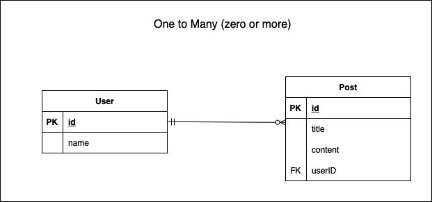

### Nested Writes で Create

create プロパティを使う

### one to many の場合



```ts
await prisma.user.create({
    data: {
        name: "Adam",
        posts: {
            create: [ // many側なので配列
                {
                    title: "post1",
                    content: "Adam's post1",
                },
                {
                    title: "post2",
                    content: "Adam's post2",
                }
            ]
        }
    }
})
```

<br>

### one to one の場合


```ts
await prisma.user.create({
    data: {
        name: "Adam",
        profile: {
            create: { // one側なのでオブジェクト
                address: "55 Wellesley Street East Auckland City, New Zealand."
            }
        }
    }
});
```

---

### Nested Writes で Update

### one to one の場合


```ts
await prisma.user.update({
    where: {
        id: 1,
    },
    data: {
        profile: {
            update: { // one側なのでオブジェクト
                address: "new address",
            }
        }
    }
});
```

<br>

### many to many / one to many の場合

update と updateMany プロパティの2通りの方法がある


1\. update プロパティを使う方法

```ts
await prisma.post.update({
    where: {
        id: 1,
    },
    data: {
        tags: {
            update: [ // many側なので配列
                {
                    // postID=1, tagID=3
                    where: { id: 3 },
                    data: { name: "update id3 tag"},
                },
                {
                    // postID=1, tagID=4
                    where: { id: 4 },
                    data: { name: "update id4 tag"},
                }
            ]
        }
    }
});
```

<br>

2\. updateMany プロパティを使う方法

```ts
await prisma.post.update({
    where: {
        id: 1,
    },
    data: {
        tags: {
            updateMany: [ // many側なので配列
                {
                    // postID=1 に紐づいたtag全て対象
                    where: {}, 
                    data: { name: "update all tag" },
                }
            ]
        }
    }
});
```

