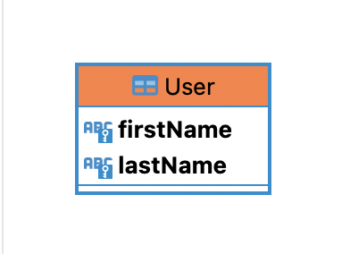

### prisma.schema の model 項目

データベースのテーブルに対応するプログラム内のオブジェクトを定義する項目

model は以下のように、テーブル名と対応するように命名し、内部にてカラム名/データ型/制約を設定する

<br>

```
// prisma.schema

model <tableName> {
    colName dataType constraint
}
```
\*colName, dataType, constraint は**半角スペースで区切ること**

---

### attributes

上記 model の設定項目である constraint のことを prisma では model の attributes と呼ぶ

#### 主な attributes 項目
    - @id/@@id: 主キーの設定
    - @unique/@@unique: unique 制約の設定
    - @default: デフォルト値の設定

<font color="red">MongoDB を利用する際は多くの制約において書き方が異なるので注意</font>

---

### 主キーの設定

1\. @id または @@id で主キーの設定を行う

- 主キーが一つの場合
    - @id で特定のカラムを主キーに設定する

    ```
    // prisma.schema

    model User {
        userId Int @id
    }
    ```

<br>

- 主キーが複数項目からなる場合(composite key)
    - @@id に複数のカラムを指定し複合主キーに設定する

    ```
    model modelName {
        col1 type const
        col2 type const
        ...

        // name: 複合主キーに別名をつける
        @@id(name: "compoundKeyName", fields: [colName,colName])


        //以下のようにnameとfieldsを省略することもできる
        @@id([colName, colName])
    }
    ```

    ```
    // prisma.schema

    model User {
        firstName String
        lastName String

        @@id(name: "fullName", fields:[firstName, lastName])
    }
    ```

    実行結果
    

<br>
<br>
<br>

2\. 複合主キーで設定する name プロパティについて

where オプションで他のカラムのように指定することができる

```ts
const user = prisma.user.findUnique(
    where: {
        fullName: {
            firstName: "John",
            lastName:  "Smith",
        }
    }
);
```

<br>

もし、nameが設定されていなかったら
```ts
const user = prisma.user.findUnique(
    where: {
        firstName: "John",
        lastName: "Smith",
    }
);
```

---

### Unique 制約の設定

@unique または @@unique でそのカラムにユニーク制約を設定することができる

主キーの設定に似ている

- 1つの項目にユニーク制約を設定したい場合
    - @id をユニーク項目の attribute に記述する

```
// prisma.schema

model User {
    id Int @id
    name String
    email String @unique
}
```

<br>

- 複数の項目に一度でユニーク制約を設定したい場合

```
// prisma.schema

model User {
    id Int @id
    name String
    email String
    IRD String

    @@unique(name: "personalInfo", [email, IRD])

    // name プロパティの省略も可能
    // @@unique([email, IRD])
}
```


---

### デフォルト値の設定

1\. @default(val) などでそのカラムにデフォルト値を設定可能

プリミティブな値をデフォルトに設定可能

```
// prisma.schema

model Products {
    name String @default("sample")
    price Int @default(1000)
    isOnSale Boolean @default(false)
}
```

以下のテーブル定義と同義

```sql
CREATE TABLE Products (
    name VARCHAR(255) DEFAULT "Product",
    price INTEGER DEFAULT 100,
    inOnSale BOOLEAN DEFAULT FALSE
);
```

<br>

2\. @default() に function を渡して設定することも可能

利用可能な functions は[こちら](https://www.prisma.io/docs/orm/reference/prisma-schema-reference#attribute-functions)

```
// prisma.schema

model Products {
    productID Int @id @default(uuid())
    registeredAt DateTime @default(now())
}
```

---

### インデックスの設定

@@index で index を張るカラムを指定できる

```
// prisma.schema

model Blog {
    id String @id @default(cuid())
    title String
    content String?

    @@id([title, content])
}
```

<br>

インデックスに任意の名前をつけたい場合は map プロパティにカスタムインデックス名を設定する　

```
// prisma.schema

model Blog {
    id String @id @default(cuid())
    title String
    content String?

    @@id([title, content], map: "myCustomIndex")
}
```

---

### enum 型の定義

enum キーワードで enum 型の定義ができる

以下の例では　User の role には "USER" か "ADMIN" のみが許容される

```
// prisma.schema

model User {
    id Int @id
    name String
    role Role
}

// enum の定義
enum Role {
    USER
    ADMIN
}
```

---

### NULL と NOT NULL

model の type field をオプショナルにすると null を許容し、それ以外は not null の制約がつく

以下の例では、 id と title は not null 制約がつき、 description は null を許容する

```
// prisma.schema

model Blog {
    id Int @id
    title String
    decription String?
}
```