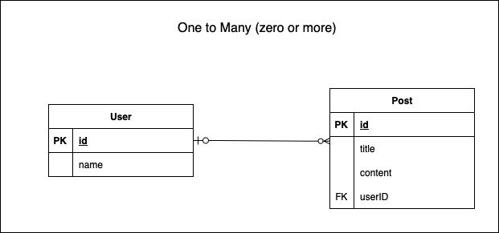
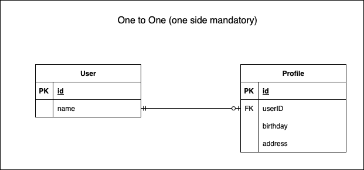
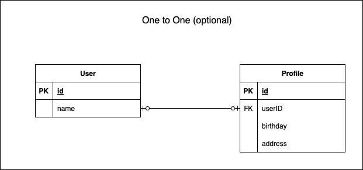

### リレーションの定義

- リレーションの定義も prisma.schema で行う

https://www.prisma.io/docs/orm/prisma-schema/data-model/relations

---

### 1対多のリレーション (one to many)

### mandatory one to many

\***User (one) 側は必ず Post に紐づく1件が存在すること**


<br>

prisma.schema での定義は以下の通り

```
model User {
    id Int @id @default(autoincrement())
    name String
    posts Post[] // zero or many
}

model Post {
    id Int @id @default(autoincrement())
    title String
    content String
    users User @relation (fields: [userID],references: [id])
    userID Int
}
```

<br>

### optional one to many

\***User (one) 側に Post に紐づく1件が存在しなくてもよい**



```
// prisma.schema
model User {
    id Int @id @default(autoincrement())
    name String
    posts Post[] // zero or many
}

model Post {
    id Int @id @default(autoincrement())
    title String
    content String
    user User? @relation(fields: [userID], references: [id])
    userID Int?
}
```

<br>

#### one to many の定義方法

```
// one側のテーブル
model One {
    prop type const

    many側参照用のprop many側のmodel型[]
}


* one側がmandatoryの場合
model Many {
    prop type const

    <One側参照用のprop> <One側のmodel型> @relation(fields: [FK名], references:[One側のカラム名])
    <FK名> <FKのデータ型>
}

* one側がoptionalの場合: model Many にて
-> <One側のmodel側> をオプショナルにする (?をつける)
-> FK のデータ型をオプショナルにする(?をつける)
```

<br>

[公式ページ: one to many](https://www.prisma.io/docs/orm/prisma-schema/data-model/relations/one-to-many-relations)

---

### 1対1のリレーション (one to one)

### one to one (one side mandatory)

\**optional に紐づく mandatory が1件は必ず存在する**



```
// prisma.schema

model User {
    id Int @id @default(autoincrement())
    name String
    profile Profile
}

model Profile {
    id Int @id @default(autoincrement())
    birthday DateTime
    address String
    user User @relation(fields: [userID], references: [id])
    userID Int @unique
}
```

<br>

### optional one to one

\***お互いに必ず紐づく1件が存在しなくてもいい**



```
// prisma.schema

model User {
    id Int @id @default(autoincrement())
    name String
    profile Profile?
}

model Profile {
    id Int @id @default(autoincrement())
    birthday DateTime
    address String
    user User? @relation(fields: [userID], references: [id])
    userID Int @unique
}
```

<br>

### 両方 mandatory は定義できない


<br>

[公式ページ: one to one](https://www.prisma.io/docs/orm/prisma-schema/data-model/relations/one-to-one-relations)

---

### 多対多のリレーション (many to many)

optional many to many しか定義できない


上記の many to many を解決するには intermediary table (中間テーブル)を作成する必要がある


<br>

### auto-create intermediary table (implicit many to many)

- prisma.schema に many to many の関係をそのまま書いてintermediary table を prisma 側で自動で作成させる方法

```
// prisma.schema

model Post {
    id Int @id @default(autoincrement())
    title String
    content String
    tags Tag[]
}

model Tag {
    id Int @id @default(autoincrement())
    name String
    posts Post[]
}
```

<br>

### self-create intermediary table (explicit many to many)

- prisma.schema に自分で intermediary テーブルを定義する方法

```
// prisma.schema

model Post {
    id Int @id @default(autoincrement())
    title String
    content String
    postTag PostTag[]
}

// intermediary table
model PostTag {
    // Post側へのFK
    post Post @relation(fields: [postID], references: [id])
    postID Int

    // Tag側へのFK
    tag Tag @relation(fields: [tagID], references: [id])
    tagID Int

    @@id([postID, tagID]) //主キーの設定
}

model Tag {
    id Int @id @default(autoincrement())
    name String
    postTag PostTag[]
}
```

<br>

[公式ページ: many to many](https://www.prisma.io/docs/orm/prisma-schema/data-model/relations/many-to-many-relations)

---

### 注意点

多の方は、"0またはそれ以上"しかできない

-> "1またはそれ以上"の多のリレーションは設定できない

