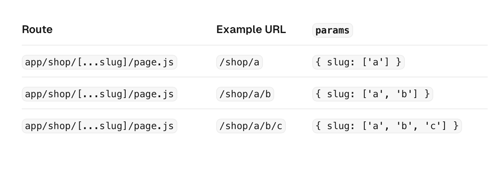
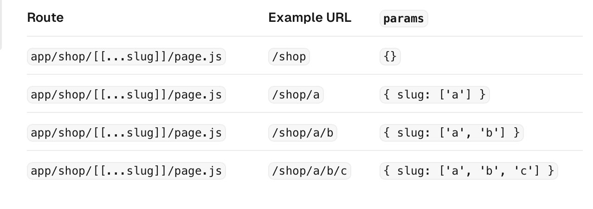
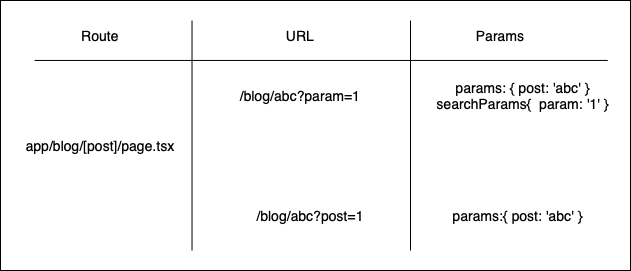

### Dynamic Routing とは

- 複数の url を一つのファイルにマッチングさせるルーティングのこと

- また、対象のファイルにマッチした url の場合、そのパスパラメーターはクエリパラメーターとしてページに送られる

- 動的ルーティングに対応させたい場合、**フォルダ名**を [] でくくる

- <font color="red"> app 直下に 動的ルーティングを利用したフォルダは置けない</font>
    - app/\[blog\]/page.tsx を配置した場合
        - / でアクセスした時 app/page.tsx か app/\[blog\]/page.tsx のどちらを表示するのか判断がつかないから

<br>

```
例: app/blog/[id]/page.tsx を作成した 

project
    |- app
        |- blog
            |- [id]
                |- page.tsx

- /blog/1 や blog/abc は app/blog/[id]/page.tsx とマッチする
``` 

---

### 注意点

- URl にマッチする動的ルーティングじゃないファイルがあった場合、動的ルーティングよりも、そのファイルが優先される


```
例: app/blog/[id]/page.tsx
    app/blog/postList.tsx が存在するとする

app
    |- blog
        |- [id]
            |- page.tsx
        |- postList.tsx

- /blog/1 にアクセス
  ->　パスパラメーター 1 を渡して page.tsx を表示する

- blog/abc にアクセス
  -> パスパラメーター abc を渡して page.tsx を表示する

- blog/postList にアクセス
  -> postList.tsx を表示する
```

<br>

- <font color="red">同階層に動的ルーティングを利用したファイルを複数置けない</font>

```
上記ルールに違反した例

app
    |- blog
        |- [travel]
            |- page.tsx
        |- [hobby]
            |- page.tsx

- blog/abc でアクセスした場合、 
  [travel]/page.tsx と [hobby]/page.tsx のどちらを表示するればいいか判断がつかない
```

---

### 利用方法

- 動的ルーティングを利用したいフォルダ名を [] でくくる

```
app
    |- blog
        |- [post]
            |- page.tsx
```

<br>

- パスパラメータを受け取りたい場合、 page.tsx のデフォルト引数 params を参照する

```ts
// app/blog/[id]/page.tsx 

const Page = ({id}: params: {id: string}) => {
    console.log(id);
    // blog/abc でアクセスした時 -> 'abc'
    // blog/100 でアクセスした時 -> '100'

    return (
        <p>{id}</p>
    );
}
export default Page;
```

---

### Catch-all Segments とは

- 複数のパスパラメーターを受け取ることができる仕組み

- 複数のパスパラメータを受け取りたい動的ルーティングフォルダ名を \[...\ ] でくくる
    - 例: app/blog/\[...post\]

<br>

```
app
    |- blog
        |- [...post]
            |- page.tsx

- blog/abc でアクセス
  -> app/blog/[...post]/page.tsx を表示
  -> page.tsx で パスパラメーター abc を参照できる

- blog/abc/def にアクセス
  -> app/blog/[...post]/page.tsx を表示
  -> page.tsx で パスパラメーター abc, def を参照できる
```

<br>

- 以下、パスと取得できるパスパラメーターの対応表



---

### Optional Catch-all Segments とは

- パスパラメーターが指定されていない url にも対応 (= optional にする) できる動的ルーティング

- Catch-all Segments な動的ファイル名をさらに [] でくくる
    - 例: app/blog/\[\[...post\]\]
<br>

```
app
    |- blog
        |- [[...post]]
            |- page.tsx

- blog/abc にアクセス
  -> app/blog/[...post]/page.tsx を表示
  -> page.tsx でパスパラメーター abc を参照できる

- blog/abc/def にアクセス
  -> app/blog/[...post]/page.tsx を表示
  -> page.tsx でパスパラメーター abc, def を参照できる

- blog にアクセス
  -> app/blog/[...post]/page.tsx を表示
  -> パスパラメーターは空
```

<br>

- 以下、パスと取得できるパスパラメーターの対応表



---

### パスパラメーターとクエリパラメーターの取得方法

- page.tsx でのデフォルトの引数に両パラメーターが渡ってくる

    - params: パスパラメーターのオブジェクト {key: value}

        - key: セグメント名 (動的ルーティングのフォルダ名)

        - value: パスパラメーター

    - searchParams: クエリパラメーターのオブジェクト {key: value}

        - key: クエリパラメーターの key 名

        - value: クエリパラメーターの値

```ts
// app/blog/[...post]/page.tsx
// blog/abc/def?query=123 でアクセスしたと仮定
export default function Page({ params, serachParams }: {
    params: { post: string },
    searchParams: { query: string}
}) {
    console.log(params);
    // { post: [ 'abc', 'def' ] }
    console.log(searchParams);
    // { query: '123' }
}
```

<br>

- 以下パスと取得できるパスパラメーターの対応表
    - 動的ルーティングのフォルダ名とクエリパラメーターのキー部分が同じ場合、**クエリパラメーターはパスパラメーターによって上書きされる**



---

### 応用編

```
以下の構成でファイルが構成されているとする

app
    |- blog
        |- [...post]
            |- page.tsx
    |-recipe
        |- [[...post]]
            |- page.tsx
```

- blog / march / travel ? page = 1 でアクセスした場合

    - blog / \[...post\] / page.tsx が表示される
    ```tsx
    params // { post: ['march', 'travel'] }
    searchParams // {page: '1' }
    ```

- recipe / beef / japanese ? id = 1　でアクセスした場合
recipe/beef/japanese?id=1
    - recipe / \[...post\] / page.tsx　が表示される
    ```tsx
    params // { post: ['beef', 'japanese'] }
    searchParams // {page: '1' }
    ```

- blog/ でアクセスした場合
    - Optional Catch-all Segments ではない
    - 404 エラー 

- recipe/ でアクセスした場合
    - recipe / \[\[...post\]\] / page.tsx が表示される
    ```ts
    parasm // {}
    searchParams // {}
    ```

