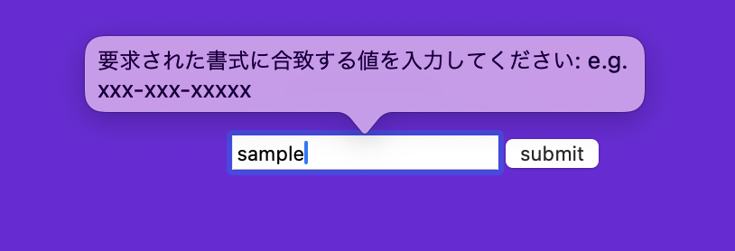

### Client Side Form Validation

- Form　要素に required 属性をつけることで、入力必須項目にできる
    - radio button は同じ name のグループのうち、どれか一つに required をつけると、そのグループが必須項目になる  
        なお、どれも選択せず subit されたら、required のついている項目にフォーカスが当たる

    - checkbox は radio button とは異なり、 required をつけた項目は選択必須項目になり、その項目をチェックしないとバリデーションに引っかかる

```html
<!-- textbox -->
<input 
    type="text"
    required
/>

<!-- textarea -->
<textarea required></textarea>

<!-- radio button -->
<label>
  <input type="radio" name="impression" value="good" required>
  OK
</label>
<label>
  <input type="radio" name="impression" value="bad">
  BAD
</label>

<!-- checkbox -->
<!-- baseballが選択必須項目になってしまう -->
<label>
    <input type="checkbox" name="sports" value="baseball" required>baseball
</label>
<label>
    <input type="checkbox" name="sports" value="soccer">soccer
</label>
<label>
    <input type="checkbox" name="sports" value="volleyball">volleyball
</label>
```

<br>

- input 要素の type 属性を number にすることで、数字のみ受けつけるようにできる
    - さらに min max 属性を指定することで、受けつける最小値、最大値を設定することができる
    - さらに step 属性を指定することで、有効な数字の間隔を設定することができる

```html
<!-- 有効な入力値は 0, 5, 10, 15,,,,100 まで -->
<input
    type="number"
    min="0"
    max="100"
    step="5"
/>
```

<br>

- input 要素に pattern 属性を指定することで、入力欄に許可する文字列のパターンを正規表現で設定できる
    - さらに、 title 属性を指定すると、画面に表示するエラーメッセージの文言を設定できる

```html
<input
    type="text"
    name="phone-number"
    pattern="^\d{3}-\d{3}-\d{5}$"
    title="e.g. xxx-xxx-xxxxx"
/>
```



---

### Server Side Form Validation

- useFormState フックを利用する
    - React の useReducer のような使い方
    - state をサーバーアクションによって更新するフック
    - useFormState は 'react-dom' から提供されている

- useFormState は action と 初期値を受け取り、 state と dispatch を受け取る
    - action: ここではサーバーアクション関数を利用
    - 初期値: state の初期値
    - state: コンポーネントの持つ状態 (state)
    - dispatch: Server Action のトリガー

- useReducer とは少し異なり、 dispatch には引数として action を渡す必要はない

- useFromState に渡された Server Actions は引数に State オブジェクト と FormData オブジェクトを受け取る
    - State: 現在の state
    - FormData: フォームデータ

- useFormState フックを利用するコンポーネントは Client Component になるので、 'use client' をファイルの先頭で宣言する

<br>

```ts
'use client';

// FormComponent.ts
import { useFormState } from 'react-dom';
import { submitFormAction } from 'Server Actions ファイルのパス'
import Link from 'next/link';

const FormComponent = () => {
    const [state, dispatch] = useFormState(submitFormAction, {error: boolean, msg: string});
    return (
        <form>
            {
                error && 
                <p>{state.msg}</p> 
                <Link href="FormComponentのページへのパス"> Try Aagin </Link>
            }

            { !error &&
            <input 
                type='text'
            />
            }
        </form>
    );
}
```

```ts
'use server';
// Server Actions ファイル

import { redirect } from 'next/navigation';
import { revalidatePath } from 'next/cache';

export const ubmitFormAction = async (state: State, formData: FormData) => {

    validate formData;

    if (formData is not valid) {
        // FormComponent 中の state に反映される
        return { error: true, msg: 'form data is not valid' };
    }
    try {
        register formData;
    } catch {
        return { error: true, msg: 'DB error'}
    }

    revalidatePath('FormComponent のページ');
    redirect('FormComponent のページ');
}
```
