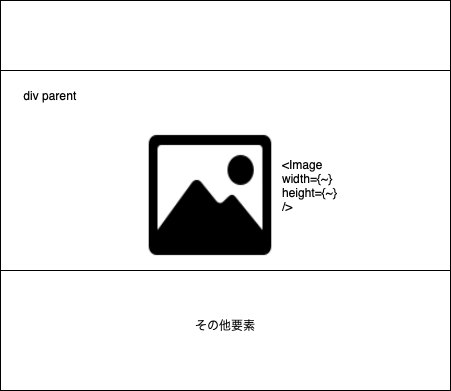
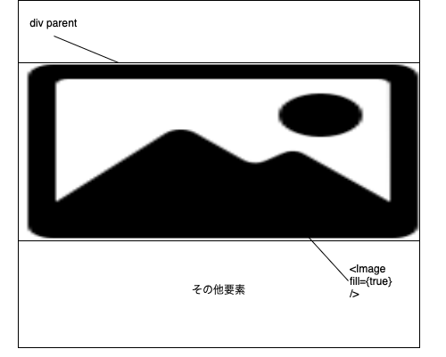

### Next.js の画像の最適化

- 画像サイズを指定しない場合には、画面サイズにあった大きさで最適化する
- Lasy Loading (遅延読み込み)を on にする  
    
などの機能を提供するモジュールが next/image

---

### 利用方法

- next/image から Image コンポーネントを取得する　

- public直下に配置した画像ファイルのパスは \/ で指定できる

- width, height プロパティは必ず指定する必要がある

```js
// MyComponent.(t|j)sx

import { Image } from 'next/image';

export const MyComponent = () => {
    return (
        <div>
            <Image
                src="パス"
                width={val}
                height={val}
                など
            />
        </div>
    );
}
```

<br>

- インポートした画像を渡すこともできる

- この時の画像のパスはコンポーネントファイルからの相対パス

- この時は width と height の指定は省略できる
    - 省略すると自動で設定される

```js
// MyComponent.jsx
import Hero from 'hero画像のパス'
import Image from 'next/image';

export const MyConponent = () => {
    return (
        <div>
            <Image
                src={Hero}
                alt="Hero image"
            />
        </div>
    )
}
```

---

### style プロパティ

- レスポンシブなデザインに利用できるプロパティ

- {} で React のようにオブジェクトを渡すことに注意

```js
<Image
    その他のプロパティ
    style={{ width: '100%', height: 'auto'}}
>
```

---

### fill プロパティ

- 対象画像要素が親要素の大きさいっぱいに広がる

- fill を指定する場合は width と height プロパティの指定はできなくなる  
    -> 親要素いっぱいに広がるから

- 対象画像の position が absolute になるので、親要素の position に relative / absolute なりを指定する必要がある

- 親要素の height は必ず指定する必要がある

- 同じレベルにある他の要素が Image 要素によって覆い被されることがあるので注意

```js
<div
    id="parent"
    style={{ widt: "~~px", height="~~px" }}
>
    <Image
        fill={true}
    />
</div>
```

<br>

- 通常の Image コンポーネントのイメージ


<br>

- fill の Image コンポーネントのイメージ


<br>

- fill を利用し、元の画像のアスペクト比を保ちたい場合 Object-fil スタイルを指定するとよいらしい

```js
<Image
    fill
    style={{ objecctFit: "conatinやcoverなど"}}
/>
```

---

### quality プロパティ

- 画質 1 ~ 100 で指定するプロパティ

- デフォルトは 75

- quality が低いほど画像サイズは小さくなるが、画質は下がる

```js
<Image
    quality={100}
/>
```

---

### placeholder プロパティ

- 画像の読み込み中に、代わりに表示する画像を設定できる(元画像をぼやかしたもの)

- デフォルトは empty 。もし、プレイスホルダーを利用したい場合は bulr を指定

- placeholder に blur を設定した場合、 blurDataURL プロパティも指定する必要がある(静的インポート画像のみ)
    - blurDataURL: base64 でエンコードされた画像データを指定する必要がある
    - 画像を base64 でエンコードするため、[plaiceholder](https://github.com/joe-bell/plaiceholder)などのライブラリを利用することが一般的

- 動的インポート画像については、placeholder に blur を指定すると　blurDataURL が自動で設定される

```js
// 静的インポート画像 (static import)
<Image
    src="画像のパス"
    placeholder="blur"
    blurDataURL={base64でエンコードされた画像データもしくはそれを返す関数}
/>
```

```js
// 動的インポート (dynamic import)
import image from "画像のパス";

<Image
    src={image}
    placeholder="blur"
/>

```

### sizes プロパティ


- img タグの sizes と同じ

- 画像要素の大きさを指定する
    - メディアクエリの media-feature-rule を指定することによって、 特定の画面幅の時の画像要素の大きさを指定することができる

