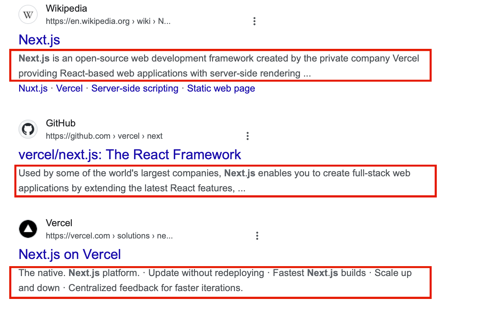
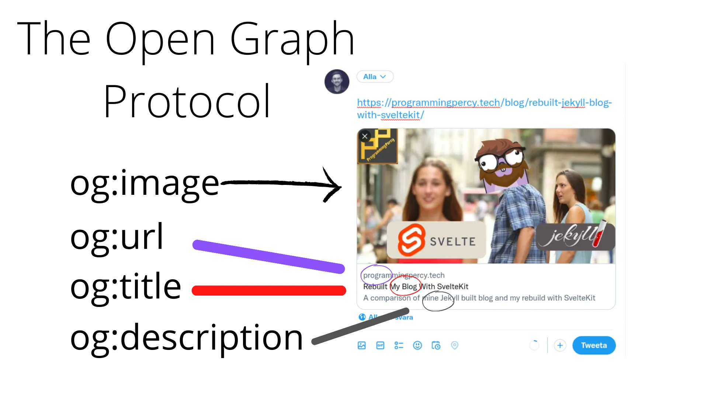

### 代表的な metadata

- title: web ページのタイトル

```html
<title>Page Title</title>
```

<br>

- description: 検索結果に表示されるwebページの説明

```html
<meta name="description" content="A brief description of the page content." />
```



<br>

- Open Graph: SNS でそのページがシェアされた際などに表示する情報

```html
<meta property="og:title" content="Title Here" />
<meta property="og:description" content="Description Here" />
<meta property="og:image" content="image_url_here" />
<meta property="og:url" content="url_here" />

```



[The Open Graph Protocol - Why And How You Should Use it On Your Website](https://programmingpercy.tech/blog/opengraph-protocol-how-and-why/)

<br>

- Favicon: ブラウザのアドレスバーに表示されるアイコン

```html
<link rel="icon" href="path/to/favicon.ico" />
```

---

### Next.js でメタデータを利用する方法

以下の2つの方法がある

1. Config-based: layout.tsx や page.tsx にて metadata 型のオブジェクトを export する方法

2. File-based: 特定のファイル名は Next.js 側で自動で解釈してメタデータに含める

もっと詳しくは[こちら](https://nextjs.org/docs/app/api-reference/functions/generate-metadata)

**\*上記の方法での metadata の付与は Server Component でしかできない**

---

### Config-based で metadata を付与する

Config-based で metadata を付与するのにも2つの方法がある

**1.Metadata オブジェクトを利用する方法**

- Metadata オブジェクトを "next" から import する

- Metadata 型のオブジェクトに項目を設定し 変数 metadata export する (named export)
    - metadata は予約語らしい

```ts
// layut.tsx
import { Metadata } from 'next';
 
export const metadata: Metadata = {
  title: 'Acme Dashboard',
  description: 'The official Next.js Course Dashboard, built with App Router.',
};
 
export default function RootLayout() {
  // ...
}
```

<br>

**2.generateMetadata 関数を利用する方法**

- generateMetadara 関数(非同期)を export する
    - generateMetadara も予約語らしい

```ts
// layout.tsx

export async function generateMetadata({ params }) {
    return {
        title: 'Acme Dashboard',
        description: 'The official Next.js Course Dashboard, built with App Router.',
    };
}

export default function RootLayout() {
  // ...
}
```

---

### File-based で metadata を付与する

詳しくは[こちら](https://nextjs.org/docs/app/api-reference/file-conventions/metadata)

例: ファビコンと Open Graph の画像を File-based で設定する

以下のファイルを用意する

- ファイル名
    - favicon というファイル名のファビコン画像(.ico)
    - opengraph-image というファイル名のOG画像(.jpg, .jpeg, .png, .gif)

- 配置場所
    - favicon は /app 直下に配置する必要がある
    - opengraph-image は page と同じ階層に配置する必要がある

```
project
    |- app
        |- favicon.ico
        |- opengraph-image.png -> /app ページをシェアした際に表示される画像

        |- blog
            |- page.tsx
            |- opengraph-image.png -> /app/blog ページをシェアした際に表示される画像
```

---

### ページによって異なるタイトルメタデータを設定したい場合

以下のようにルートページには "Next.js Tutorial" というタイトルを設定し、 /blog ページには "Next.j Tutorial Blog Page" というタイトルを設定したい

```
project
    |- app
        |- page.tsx // title: Next.js Tutorial
            |- blog (dir)
                |- page.tsx // title: Next.j Tutorial Blog Page
```

- 方法1: 各ページ/レイアウトで metadata を設定する

    - 各 page/layout にて metadata を設定し export する

    - 入れ子のページの metadata は 子ページ の metadata が優先される (親ページの metadata を上書く)

    ```ts
    // app/page.tsx
    import { Metadata } from 'next';

    export const metadata: Metadata = {
        title: "Next.js Tutorial"
    }
    ```

    ```ts
    // app/blog/page.tsx
    import { Metadata } from 'next';

    export const metadata: Metadata = {
        title: "Next.j Tutorial Blog Page"
    }
    ```

<br>

- 方法2: metadata オブジェクトの title プロパティに　template プロパティを持つオブジェクトを設定する

    - 親 page/layou にてタイトルの雛形を設定する
    ```ts
    // app/page.tsx
    import { Metadata } from 'next';

    export const metadata: Metadata = {
        title: {
            // タイトルに雛形
            template: "Next.js Tutorial %s",

            // 子page/layoutでタイトルメタデータが設定されていない場合に適用されるタイトル
            default: "Next.js Tutorial"
        }
        "Next.js Tutorial"
    }
    ```

    - 子 page/layout にて親 page/layout の雛形タイトルをもとに独自のタイトルを設定する
        - 親 page/layout で設定した template の %s の部分が、子 page/layout で設定する title に置き換わる
    ```ts
    // app/blog/page.tsx
    import { Metadata } from 'next';

    export const metadata: Metadata = {
        title: "Blog Page", // "Next.js Tutorial Blog Page"
    };

    /**
     * 以下のように generateMetadata 関数で設定しても良い
     *
     * export async function generateMetadata({prop}) {
     *      return {
     *          title: "Blog Page", // // "Next.js Tutorial Blog Page"
     *      } satisfies Metadata;
     * } 
     */
    ```