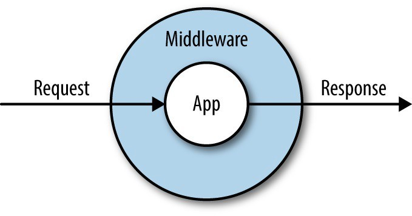
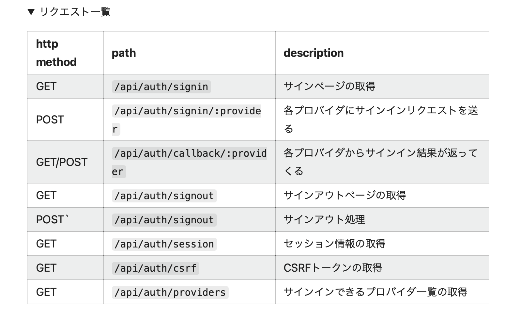
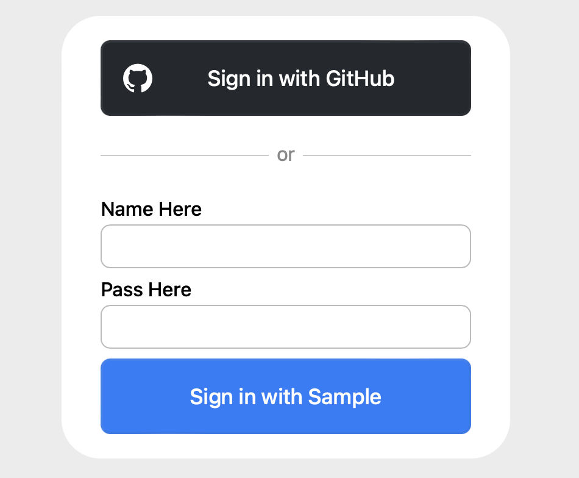

### NextAuth.js と Auth.js の違い

- NextAuth.js は メジャーバージョンアップによって Auth.js (v5) になった

- Auth.js が利用できる Next.js の バージョンは 13.4 以上 

- 上記条件より、 Auth.js は App Router のディレクトリ構成で利用する (Page Router もサポートはされているs)

---

### Auth.js　ができること

- OAut / OpenID Connect 認証
- Email 認証 (Email Authentication)
- ユーザー名&パスワード認証 (Credentials Authentication)

---

### 利用の流れ

まずは npm や yarn でインストール

```bash
npm install next-auth@beta
```

0. 秘密鍵の生成&設定

```bash
# 秘密鍵の生成
openssl rand -base64 32
```

```
# .env
AUTH_SECRET=生成した秘密鍵
```

<br>

1. Authモジュールで使用される設定オブジェクト (NextAuthConfig 型) を作成する (auth.ts|js)

    - 慣例では、プロジェクトルートに作成する

```ts
// auth.ts

// "next-auth" から NextAuthConfig を import
import { NextAuthConfig } from "next-auth";

// 自分のアプリで使う認証や、ログインページのパスによって適当な設定を行う
const config = {
    // provider プロパティは必須
    provider: []
} satisfies NextAuthConfig;
```

<br>

- <font color="red">**NextAuthConfig の詳しい設定方は**</font>[こちら](#config)

<br>

2. 1で作成した設定オブジェクトを NextAuth NextAuth 関数から返ってきた "auth 関数"、 "handelrs オブジェクト"、 "signIn 関数"、 "signOut 関数" を受け取る

```ts
// auth.ts

import { NextAuthConfig } from "next-auth";

const config = {
    provider: [自分の利用する認証方法],
    その他の設定項目
} satisfies NextAuthConfig;

// NextAuth 関数からの戻り値を export する
export const { handers, auth, signIn, signOut } = NextAuth(config);
```

<br>

3. API エンドポイントを作成し、 handlers オプジェクトの GET 関数と POST 関数を export する

    - 理由: 認証プロバイダーと認証情報のやり取りをするため

    - ディレクトリ構成に注意   
    route.js は \[...フォルダ名\] (Optional Catch-all Segments) に配置すること: [理由はこちら](#endpoint)

```
project
    |- app
        |- api
            |- [...myAuth] #フォルダ名はなんでもいい
                |- route.ts|js
```

```ts
// route.js
import { handlers } from 'auth.ts|jsのパス';

export const { GET, POST } = handler;
```

<br>

5. page ファイルもしくは component から、signIn 関数や signOut 関数を呼び出す
    - [signIn/signOutの使い方はこちら](#sign-in-out)

<br>

#### middleware を使いたい場合

- そもそも middleware とは
    - express でのミドルウェアと同じもの
    - クライアントからリクエストを受け、任意の処理を行いアプリに渡す & アプリからレスポンスを受け、任意の処理を行いクライアントに渡す処理のこと
    

    [Custom middleware for logging requests and responses in web api core.](https://www.linkedin.com/pulse/custom-middleware-logging-requests-responses-web-api-core-vithala)

<br>

6. プロジェクトルートに middleware.ts|js を作成する

```
project
    |- middleware.ts|js
```

<br>

7. Auth.js の 設定を記述したファイル (auth.ts|js) にて、 <font color="red">NextAuthConfig オブジェクトの callback プロパティにて、 authorized 関数を定義する</font>

    - authorized関数とは:
        - middleware.ts の matcher で指定したページにアクセスする前に実行される処理

        - セッションの認証情報を確認できたらページへのアクセスを許可し、確認できなかったらログインページに飛ばす などを行う

    - 引数:{reqest, auth}

    - authにセッションデータが格納されている

    - 戻り値: true を返すと、

    - 戻り値 false を返すと、

```ts
// auth.ts
// 途中省略

const config = {
    ~,
    callback: {
        // middleware で matcher に指定したページにアクセスする前に走る処理
        authorized({req, auth}) {
            /** 認証完了後のauthは以下の通り
             *  auth:
             *  {user: {name: "ユーザー名",など}}
             */

            /**
             * 以下のケースは認証未完了
             * 1. authがnull
             * 2. auth.userがundefined
             */
            if (auth && auth.user) {
                return true;
            } else {
                // redirect to login page
                return false;
            }

            // 上の条件分岐よりこっちの方が1行で済む
            // return !!auth?.user;
        }
    }
} satisfies NextAuthConfig;
```

<br>

8. middleware ファイルにて、 auth.ts|js で定義した設定を NextAuth 関数に渡した際に返ってきた auth 関数を export する

```ts
// middleware.ts

export {auth as middleware} from "auth.tsのパス";
```

<br>

9. middleware の処理をどのパスで動かしたいのかが明確な場合 middleware.ts にて設定する

    - matcher: string[] をプロパティに持つ config オブジェクトを作成し、exportする (named export)

```ts
// middleware.ts

export {auth as middleware} from "auth.tsのパス";

export const config = {
    matcher: ["ミドルウェアを動かしたいパス(正規表現も可)"]
}
```


---
<div id="config"></div>

### NextAuthConfig の設定

設定項目

- providers: 利用する認証方法

<br>

- pages: ログイン/ログアウト、認証エラーなどのページのパスを登録する項目

    - 設定可能な項目については[こちら](https://authjs.dev/guides/basics/pages)

<br>

- basePath: API エンドポイントのパスを設定

    - デフォルトでは /api/auth になっていて、 handler の GET や POST が処理する パスのベース部分をカスタマイズできる

<br>

- callbacks: 認証プロセスの特定のタイミングで実行されるコールバック関数を登録する項目

    - callbacksの項目については[こちら](https://authjs.dev/reference/nextjs#callbacks)

    - middleware を利用する場合は、 authorized 関数を必ず設定すること

```ts
// auth.ts|js

// GitHubのOAuth認証に必要なモジュール
import github from "next-auth/providers/github";
// Credential Authentication に必要なモジュール
import Credentials from "next-auth/providers/credentials";

const config = {
    provider: [github, Credentials({
        // Credential Authenticationに必要な設定
    })],
    pages: {
        //自作したサインインページのパス
        signIn: '/signIn',
    }
    basePath: 'カスタマイズするベースパス',
    callbacks: {
        // middlewareを利用する場合は必須
        authorized({request, auth}) {
            // middlewareでの処理内容
        }
    }
} satisfies NextCongfigAuth;
```

---
<div id="endpoint"></div>

### API エンドポイントのディレクトリ構成について

なぜ /api/auth/\[...フォルダ名\]/route.js の構成でapiエンドポイントを作成する必要があるのか?

- NextAuth 関数で取得する handlers オブジェクトの GET, POST メソッドは以下の URL をハンドルする



[Auth.jsを完全に理解する (Next.js App Router 実装編) #2](https://qiita.com/kage1020/items/8224efd0f3557256c541)

- よって、 /api/auth/\[...フォルダ名\]/route.js で上記の path に適応できるディレクトリの構成をする必要がある

- NextAuthConfig の basePath を設定することで、 /api/auth の部分をカスタマイズすることができる

---
<div id="sign-in-out"></div>

### signIn / signOut の使い方

- Client Component と Server Component で使い方が異なることに注意

<br>

#### Client Component の場合

    - "next-auth/react" から提供される signIn/signOut 関数を利用する

```ts
'use client';

import { signIn, signOut } from "next-auth/react";

const ClientComponent = () => {
    return (
        <div>
            <button onClick={() => signIn())}>Sign In</button>

            <button onClick={() => signOut()}>Sign Out</button>
        </duv>
    );
};

export default ClientComponent;
```

<br>

#### Server Component の場合

    - auth.ts|js のような設定ファイル内の NextAuth(config) から生成した signIn/signOut 関数を利用する

```ts
// auth.ts
import NextAuth, { NextAuthConfig } from "next-auth";

const config = {
    // 自分のアプリに合った設定
} satisfies NextAuthConfig;

export { handlers, auth, signIn, signOut} = NextAuth(config);
```

```ts
// Server Component ファイル
import { signIn, signOut } from "auth.ts|jsのパス";

const ServerComponent = () => {
    return (
        {// Sign-in Button}
        <form action={ async () => {
            'use server';
            // server actions
            await signIn();
        }}>
            <button type="submit">Sign In</button>
        </form>
        
        {// Sign-out Button}
        <form action={ async () => {
            'use server';
            await signOut();
        }}>
            <button type="submit">Sign Out</button>
        </form>
    );
};

export default ServerComponent;
```

---

### API エンドポイントのカスタマイズ方法

例: 以下のディレクトリ構成でAPIエンドポイントを作成したい場合
```
project
    |- app
        |- tutorial
            |- [...nextauth]
                |- route.ts|js
```

- NextAuthConfig の basePath を変更する

```ts
// auth.ts
import NextAuth, {NextAuthConfig} from "next-auth";

const config = {
    // app以下からroute.jsの親ディレクトリ[...フォルダ名]までのパスを設定する
    basePath: "/tutorial/sample",
} satisfies NextAuthConfig;
```

すると、以下の Auth.js で提供されるハンドラの path 部分が /api/auth/~ から /tutorial/sample/~ にカスタマイズされる


<br>

しかし、 /api/auth/session などは、NextAuthConfig の basePath の変更は適用されない。

次の方法を使って session へのアクセスのための path を変更する

- SessionProvider の basePath 
を変更する

```ts
// providers.tsx
"use client";

import { SessionProvider } from "next-auth/react";
import React, { ReactNode } from "react";

const Providers = ({ children }: { children: ReactNode }) => {
    {// basePath を　auth.ts の basePath に揃える　}
    return <SessionProvider basePath="/tutorial/sample">{children}</SessionProvider>;
};

export default Providers;
```

---

### ユーザー名&パスワード認証の設定方法 (Credential Authentication)

ポイント

- provider に設定するCredentialsに渡す設定オブジェクトに注意

1. "next-auth/providers/credentials" から　credentials 関数を importする (auth.ts|js)

```ts
// auth.ts
import Credentials from "next-auth/providers/credentials";
```

2. credentials 関数に credential 設定オブジェクトを渡し、 CredentialsConfig オブジェクトを取得する

    - credential 設定オブジェクトの項目

        - name: デフォルトログインページにあるログインボタンのラベル

        - credentials: デフォルトログインページのフォームの項目

        - async authorized: ユーザー名&パスワードでログインした際に呼び出される処理

            - 引数は上記で定義した credentials

            - 認証成功の場合、ユーザーオブジェクトを返す
                - OAuth 認証成功時にセッションに入る user オブジェクトと同じもの
                
            - 認証失敗の場合、 null を返す

    - async authorized で返却するユーザーオブジェクトのデータ型

    ```ts
    {
        user: {
            id?: string,
            name?: string | null,
            email?: string | null,
            image?: string | null
        }
    }
    ```


```ts
// auth.ts
import Credentials from "next-auth/providers/credentials";

const credentialsCofig = Credentials({

    name: "Sample", // ログインボタンのラベルの一部

    credentials: { // ログインフォームの項目
        name: { // ユーザー名
            label: "Name Here", // ユーザー名の入力項目のラベル
        },
        password: { // パスワード
            label: "Pass Here", // パスワードの入力項目のラベル
            type: "password",
        }
    },

    async authorized(credentials) {
        // ユーザー名&パスワードでの認証処理
        if (DBにcredentials.name
              とcredentials.name
            で一致する情報がある
        ) {
            return {
                ユーザーオブジェクトの項目に任意の値を設定
            };
        } else {
            return null;
        }
    }
});

// Credentials Cofig を NextAuthConfig の providers に渡す
const config = {
    providers: [credentialsCofig],
} satisfies NextAuthConfig;
```



---

### OAuth認証の設定方法 (OAuth Authentication)

ポイント

- 認証に利用したいサービスの provider モジュールを NextAuthConfig の providers に設定すること

- .env ファイルに、以下の形式でIDとSecretを設定することで、 auth.ts|js 側で設定する必要がなくなる

```ts
// auth.ts
import NextAuth, { NextAuthConfig } from "next-auth";
import github from "next-auth/providers/github";

const config = {
    //認証に利用したいサービスの provider モジュールを NextAuthConfig の providers に設定する
    providers: [ github ],
} satisfies NextAuthConfig

export const { handlers, auth, signIn, signOut } = NextAuth(config);
```

```
# .env
# AUTH_[PROVIDER]_[ID/SECRET] の形式で ID と Secret を設定する

AUTH_GITHUB_ID=your_client_id
AUTH_GITHUB_SECRET=your_client_secret
```

---

### Session の利用方法

- Client Compoent にて、セッションに入っている認証情報を取得したい場合
    -　"next-auth/react"　から提供される useSession を利用する
    - useSession を利用するために SessionProvider でアプリ全体を囲む必要が合ある

```
プロジェクト構成の例
project
    |- app
        |- lauyout.tsx // ルートレイアウト
    |- provider.tsx // SessionProviderコンポーネント
```

<br>

まずは、 provider.tsx にて　SessionProvider コンポーネントを利用する

```ts
// provider.tsx
import { SessionProvider } from "next-auth/react";
import React, { ReactNode } from "react";

const Provider = ({children}: {children: ReactNode}) => {
    return (
        <SessionProvider>
            {children}
        </SessionProvider>
    );
};

export default Provider;
```

<br>

次に、 layout.tsx にて、アプリ全体を SessionProviderコンポーネントで囲む
```ts
import Provider from "provider.tsxのパス";

export default function RootLayout({
  children,
}: Readonly<{
  children: React.ReactNode;
}>) {
  return (
    <html lang="en">
      <body className={inter.className}>
        {// アプリ全体を SessionProvider コンポーネントで囲む}
        <Provider>
          <AppBar />
          {children}
        </Provider>
      </body>
    </html>
  );
};
```

<br>

すると、以下のようにクライアントコンポーネントにてuseSessionを使って認証情報を格納したセッションを取得できる

```ts
// クライアントコンポーネント
'use client';
import { useSession } from "next-auth/react";
export const ClientComponent = () => {
    const { data: session } = useSession();
    /**
     * useSession() が返すオブジェクト
     * {
     *  update: UpdateSession;
     *  data: Session;
     *  status: "authenticated";
     * }
     */
}
```

<br>

- 一方、 Server Component にてセッションに入っている認証情報を取得したい場合...
    - auth.ts|js で export する auth 関数を呼び出すことでセッションの取得ができる
    - これに関しては、 SessionProvider でアプリ全体を囲む必要はない

