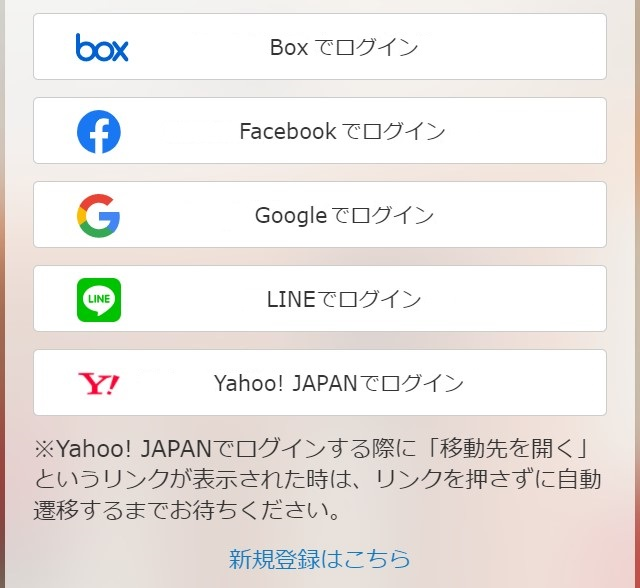
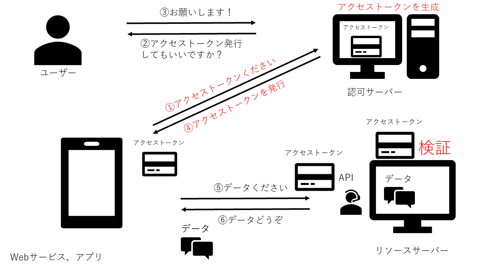

### OAuth とは

- Authentication のプロトコル
    - Authentication: ユーザーが本人かどうかを確認するための仕組み

- 外部のサービスやデータへのアクセスの際によく利用される
    - 例: とあるwebサービスのユーザーアカウントの登録に、 Twitter / Facebook / Google のアカウントを利用できたりするのも OAuth 

- OAuth での外部サービスのデータへのアクセスの流れ
    - 例: アカウントでログインの際に、外部サービスのアカウントでログインできるようにする

 

1. webサービス側で、ユーザーが外部サービスのデータ利用を選択する -> 認可サーバーに選択されたデータへのアクセストークンを要求する

2. 認可サーバー側から、そのリソースオーナーにアクセスを許可するかどうかを聞く

3. リソースオーナーがアクセスの許可/禁止を答える

4. リソースオーナーがアクセスの許可をした場合、認可サーバーがクライアントアプリにアクセストークンを発行する

5. クライアントアプリが、アクセストークンと一緒に、必要なデータを要求する

6. リソースサーバーにてアクセストークンを検証し、データを返却する

[OAuthとOpenID Connectについて～仕組みや特徴など解説～](https://solution.kamome-e.com/blog/archive/blog-auth-20221108/#OAuth)

 

- 多くの場合、アクセストークンは　JSON Web Token という形式を用いるらしい

---

### OpenID Connect

- OAuth をベースにした ID 認証

    [一番分かりやすい OpenID Connect の説](https://qiita.com/TakahikoKawasaki/items/498ca08bbfcc341691fe)

 

- OAuth が ID 認証に使えない訳ではないが、セキュリティホールになるので、使ってはいけない。代わりに OpenID Connect を利用すること

    [単なる OAuth 2.0 を認証に使うと、車が通れるほどのどでかいセキュリティー・ホールができる](https://www.sakimura.org/2012/02/1487/)

    [OpenID Connect についてと OAuth2.0 との違いを調べてみた](https://zenn.dev/mryhryki/articles/2021-01-30-openid-connect)

