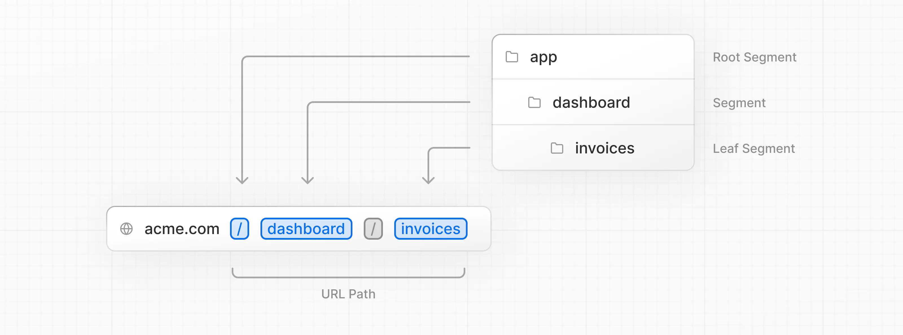

### Page と Layout とは

- page はアプリケーション内の個々の画面を表現する
    - 例: /about のページや / のインデックページなどなど

- layout はアプリケーション内の複数のページに共通の構造を表現する
    - 例: ヘッダーやフッターなど、複数ページに共通するレイアウト

- page と layout はデフォルトエクスポートじゃないと上手くルーティングされない

---

### App router 

- app 配下のフォルダとファイルの構造は、ウェブサイトの URL 構造に直接マッピングされる



---

### page

- app / {パス} / page.tsx (jsxなど) を作成すると、 https://{ホスト}.{ドメイン}:{ポート番号}/{パス}でアクセスできるようになる

<br>

例: app/home/page.tsx を作成する

*default export じゃないと、下記のようなエラーメッセージが表示される  
-> **The default export is not a React Component in page: "/{パス}"**

```ts
const Page = () => {
    return (
        <p>
            Hello World
        </p>
    );
};

default export Page;
```

/home でアクセスできるようになる

---

### layout

- /app/{パス}/layout.tsx (jsxなど) を作成すると、 app/{パス} 配下の全てのページにそのレイアウトが適用される

- layout は page をラップするので、 {children : Reacr.ReactNode} を引数に必ず取る

<br>

例: app/home/layout.tsx を作成する

```ts
const Layout = (children: { children : React.ReactNode }) => {
    return <>{children}</>;
};

export default Layout;
```

- 例えば、以下のようなプロジェクトの構成の場合

    - /home と /home/about と /home/other のページに　app/home/layout.tsx　のレイアウトが適用される
    ```
    project
        L app
           L home
                |- page.tsx
                |- layout.tsx
                |- about
                    L page.tsx
                L other
                    L page.tsx
    ```

---

### page と layout の構成のメリット

- 何が嬉しいのか
    - /home 配下のページにアクセスしている限り、 layout.tsx の部分は際レンダリングされず、　layout.tsx 内の {children} の部分 (/home 配下の page.tsx) だけが再レンダリングされる。  

     -> 無駄な際レンダリングがなくなるので、表示スピードが上がる
