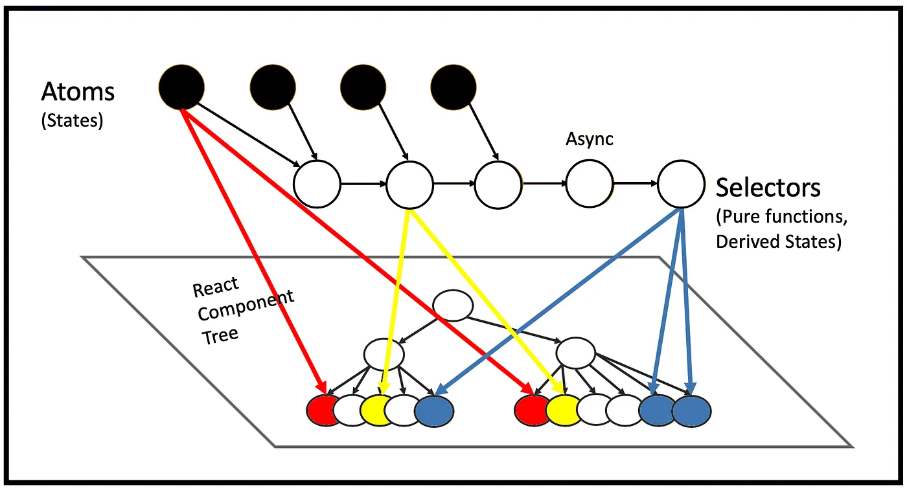

### Recoil とは

コンポーネント( UI )の状態( state )を管理するためのライブラリ

React Hooks の useState() はコンポーネント内でのstate（状態）を管理するのに対し、 Recoil はアプリケーション全体での state を管理する

他の同じようなライブラリとして Redux が有名

---

### イメージ

- Atom: 状態の単位。状態は Atom に保持されている
    - <font color="red">Reduxはアプリケーション全体で状態管理を行うストアが一つなのに対し、RecoilはAtom単位で一つ一つの状態管理を行う</font>

- Selector: Atom や 他の Selector を受け取る関数かつ Atom の 派生 state。　受け取った Atom / Selector を加工して新しい値を作成したり、受け取った Atom / Selector の値を更新することができる。参照元が更新されると自身の Selector が再計算され、 UI の再レンダリングが走る

<br>



---
 
### 使い方

- Recoil の有効化

対象範囲を RecoilRoot コンポーネントで囲む

トップレベルの layout で children を囲むとアプリケーション全体で状態管理を行うことができる

```js
// layout.tsx
import { RecoilRoot } from "recoil";

export default function RootLayout({
  children,
}: Readonly<{
  children: React.ReactNode;
}>) {
  return (
    <html lang="en">
      <body className={inter.className}>
        <RecoilRoot>{children}</RecoilRoot>
      </body>
    </html>
  );
}
```

---

### Atomの利用

- Atom (state管理)の作成

atom() で Atom を作成する  
引数-> {key: 一意のキー名, default: 初期値}

<font color="red">RecoilRoot を使うためには、 "use client" 宣言しクライアントサイドレンダリングにする必要がある</font>

```js
// recoil.tsx
import { atom } from 'recoil';

const clickCount = atom({
    key: "clicks",
    default: 0,
});

export {clickCount};
```

<br>

- useRecoilValue で Atom の読み込みを行う

<font color="red">useRecoilValue で読み取るだけのコンポーネントはサーバーサイトコンポーネントでいい</font>

```js
// Component.tsx
import { clickCount } from "atomを定義したファイルのパス";
import { useRecoilValue } from 'recoil';

export const Component = () => {
  // 読み取りたい Atom を渡す 
  const clickNum = useRecoilvalue(clickCount)

  return <>{clickNum}</>;
};
```

<br>

- useRecoilState で Atom の読み込み/書き込み

useRecoilState という hooks　で useState と同じように Atom の読み込み/書き込みを行うことができる

```js
// Counter.tsx
"use client";
import { clickCount } from "atomを定義したファイルのパス";
import { useRecoilState } from "recoil";

const Counter = () => {
  // 書き込み/読み取りたい Atom を渡す
    const [count, setCount] = useRecoilState(clickCount);

    return <div onClick={() => setCount((prev) => prev + 1)}>add 1</div>;
};

export default Counter;
```

---

### Selector の利用

- Selector の作成

Selector は Atom/他のSelector を受け取る関数かつ Atom の派生 state

selector() で作成する
- {key: "一意のキー名", get: Atomを加工して返却する関数}

<font color="red">key, get プロパティは必ず必要</font>

<font color="red">getプロパティに定義した関数は必ず return で値を返すこと</font>

```js
// recoil.tsx
'use client';
import { atom, selector } from 'recoil';

// Atom
const clickCount = atom({
    key: "clicks",
    default: 0,
});

// Selector
const clickCountState = selector(){
    key: "clickCountState",
    // get プロパティは必ず実装する必要がある
    get: ({get}) => {
        // get() で Atom に保存されている状態の取得
        const clicks = get(clickCount);
        // 必ずreturnで値を返すこと
        return `you clicked a button ${clicks} times.`;
    },
};

export {clickCount, clickCountState};
```

<br>

- Selector から値を取得する

userRecoilValue は Atom だけではなく、 Selector の値も読み取ることができる (Selector は Atom の派生 state　だから)

```js
// Counter.tsx
"use client";
import { clickCountState } from "Selectorを定義したファイルのパス";
import { useRecoilValue } from "recoil";

const Counter = () => {
    // 読み取りたい Selector を渡す
    const clickNum = useRecoilValue(clickCountState);

    return <div>{clickNum}</div>;
};

export default Counter;
```

---

### Selector で他の Atom の値を更新する方法

selector() に set プロパティを渡す
- set: ( { set }, val ) => {関数内部でset()を呼び出し、Atomの値を更新する}
  - {set}: Atom/Selectorの値を更新するための関数 
  - val: 呼び出し側で渡した値がくる

<font color="red">key, get プロパティは必ず必要</font>

```js
// Recoil.tsx
import { atom, selector } from 'recoil';

// Atom の定義
const clickCountAtom = atom({
  key: "clickCount_A",
  default: 0,
});

// Selector の定義
const clickCountSelector = seletor({
  key: "clickCount_S",
  get: ({ get }) => {
    // click回数を管理するAtomからstate取得
    return get(clickCountAtom);
  },
  set:({set}, val) => {
    set(clickCountAtom, val);
  }
  
});
```

<br>

- useSetRecoilState で Selector の set を呼び出す

```js
// CounterBtn.tsx
'use client';
import { useSetRecoilState } from "recoil";
import { clickCountSelector } from "Selectorを定義したファイルのパス";

export const CounterBtn = () => {
  // useSetRecoilState に Selector を渡す
  const incrementCount = useSetRecoilState(clickCountSelector);

  const increment = () => {
    // useState の set 関数の使い方と同じ
    incrementCount((prev) => prev + 1);
  };
  return <button onClick={increment}>increment</button>;
};
```

---

### Atom/Selector の値をリセットする

useResetRecoilState　という hooks を利用する

```js
// ResetButton.tsx
import { useResetRecoilState } from "recoil";
import { clickCountAtom } from "Atomを定義したファイルのパス";

export const ResetButton = () => {
  // useResetRecoilStateにAtomを渡す
  // clickCountAtomのSelectorであるclickCountSelectorを渡してもいい
  const reset = useResetRecoilState(clickCountAtom);

  return <button onClick={reset}></button>
}
```

---

### useRecoilState(), useRecoilValue(), useSetRecoilState(), useResetRecoilState() の違い

- useRecoilState(): Atom/Selector の読み取り&更新

- useRecoilValue(): Atom/Selector の読み込みのみ可能

- useSetRecoilState(): Atom/Selector の更新のみ可能

- useResetRecoilState(): Atom/Selectorの値を初期化することのみ可能

[詳しいサイト](https://sagantaf.hatenablog.com/entry/2024/02/25/230215)